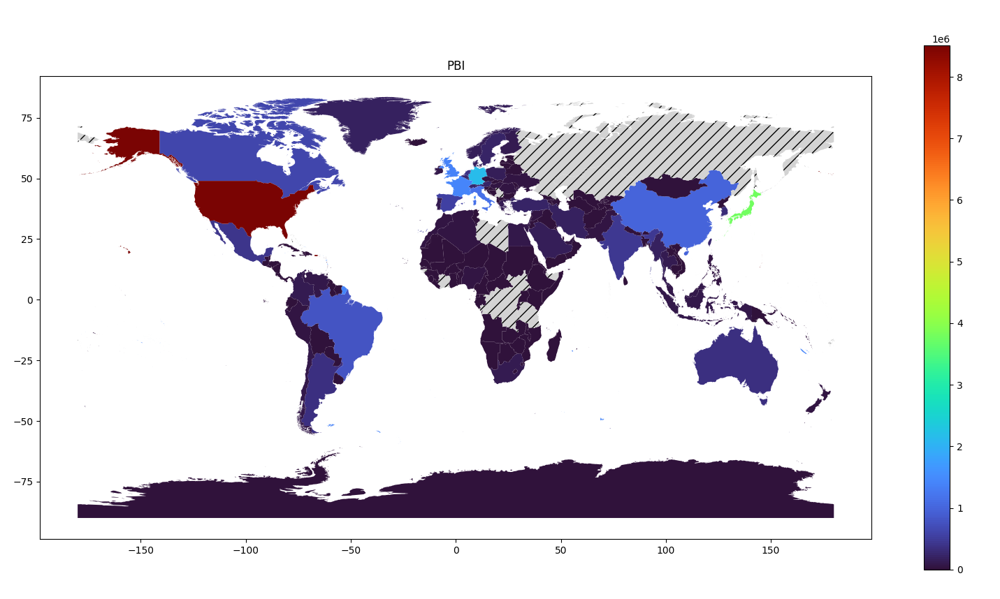

# TP3-SGBD: PostgreSQL world
<h4> Trabajo práctico 3 de Sistemas de Gestión de Base de Datos. </h4>

## Descripción

 Consiste en un trabajo sobre un conjunto de datos dado en la BD world.sql 

 Este se importa a una base de datos en PostgreSQL, llamada de la misma forma, a partir de la cual se trabaja. Se utiliza tanto PosgreSQL shell como pgAdmin 

## Detalle de los archivos

#### practica3.pdf

 Es consigna. Se recomienda leer para entender el propósito de cada paso 

#### world.sql

 El archivo "world.sql" es la base de datos que se importa y con la cual se trabaja
 

#### Configuraciones - Aclaraciones.pdf

 Da uan descripción precisa del paso a paso y las configuraciones necesarias

#### ejer3.1.sql, ejer3.2.sql, ejer3.3.sql

 Son las soluciones respectivas a cada uno de dichos puntos. Consisten en querys SQL 

#### 3.4.py y su carpeta

 Ya conectando python con postgreSQL mediante psycopg2

 Se trabaja con un .csv, dataFrames de pandas y psycopg2 para insertar valores en una nueva tabla sitio según ciertos requisitos 

#### 3.5.sql y analisis.pdf

 Se prueba e investiga sobre la utilización y creación de indices 

#### 3.6.py y su carpeta

 Este punto requiere la utilización de los archivos existentes para crear un GeoDataFrame que servirá para poder crear varios gráficos (Mapa Choropleth) según lo pedido 

